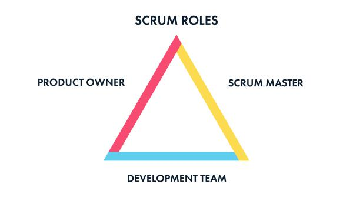

# Documentation for GTM Sportswear
This Git repository holds various documents related to process, coding standards, new employee information, and more.

This information can be updated quite often, but is all peer reviewed. If you see an error or would like to add something yourself, open a pull request!

## The Development Process
### Agile Scrum
**Scrum** is one of several techniques for managing product development organizations, lumped under the broad category of agile software development. 

**Agile** approaches are designed to support iterative, flexible, and sustainable methods for running a product engineering organization.

### Scrum Roles
Scrum has no hierarchy, but each of the three roles has equal and defined responsibilities.

#### Stakeholders
A product owner controls and steers a product in a direction that benefits the company and customers. The product owner is involved in steering committee meetings and responsible for pushing ideas for development.

A business owner has a shared responsibility to the team and to the customer. The business owner is the voice of the customer, and stands in as the representative of the customer's needs, wants, and expectations.

#### Scrum Master
A scrum master is the glue that ties a scrum team together. Scrum masters are responsible for keeping people clear on their roles, managing the rituals and artifacts of scrum, and coaching people within the team and across the organization to help overcome blockers and maintain a sustainable productive pace.

Their responsibilities include the daily stand-up, the [sprint planning](#Planning) meeting, the [sprint review](#Review) meeting with stakeholders, and the [sprint retrospective](#Retrospective) meeting.

#### Developer
Most scrum teams consist of a set of four to eight members. Their specializations should be planned to support the type of work the team is going to be responsible for, so they can estimate it well and produce results that meet the team's definition of done.

A team member is responsible for the quality of the product being developed, and for the preservation of the scrum process for the entire team. These are two aspects that every team member has the authority to affect by the way they perform their duties.

The team is expected to *push back against any attempts to sacrifice quality for the sake of speed*, given the practical constraints of the project. Additionally, the team should be tracking the overall quality of the code-base, and proposing stories that would refactor the existing code to enhance maintainability, or to support emerging technical standards. Keeping the code clean, self-documenting, and internally consistent helps everyone on the team work together more effectively.

### Scrum Process

#### Ideation
Where all great ideas start out. They come here for review and to collect further details until a time when the steering committee decides to move forward with it.

#### Scoping
When ideas have been approved to move forward by the steering committee, they move into scoping. Scoping is a time to get rough estimates of work to be done in the form of a T-Shirt sizing, compile cost, revenue and ROI information, and complete out feature requirements:

* Problem
* Vision
* Goal
* MVP Requirements
* Launch Plan

Scoping is also a time for team leads to ask initial questions to the stakeholders and get feedback before refinement.

**When does this meeting occur?** Whenever scoping work needs to be done after items move over from ideation.

User stories should be defined or made clear during scoping. Ideally, stakeholders are responsible for creating user stories, which define value in the perspective of a customer. Until user stories are defined, there are no artifacts available to be moved into refinement.

#### Refinement
The refinement meeting is a time-boxed meeting for the scrum team to get in the same room and accomplish two very important tasks:

1. Groom the backlog so that two to three sprints' worth of user stories are ready for development.
2. Refine backlog user stories to be ready for development.

**When does this meeting occur?** The second Monday of a sprint.

During refinement, with the help of the scrum master and product owner, the scrum team should be able to define priority and associate user stories to the correct sprint based on business needs.

Ideally, user stories should go through two refinement meetings before development commences on them. The first refinement meeting would be the coarse refinement which you narrow down acceptance criteria and clarify business objectives. The second refinement would be for defining discrete tasks for work to be done based on the acceptance criteria.

Be careful not to **overplan**. User stories should have just enough planning to get started on development. It is okay to have some unanswered questions during the sprint **collaboration between a developer and stakeholder is encouraged**.

#### Planning
The planning meeting is a time-boxed meeting for the scrum team to get in the same room and decide which user stories they are going to work on for the sprint.

User stories and their tasks should be assigned to individual developers to be worked on. Developers should have a good idea of what they would want to work on based on expertise.

During planning, if there is significant rollover of stories from the previous sprint, it may be necessary to move out other user stories at this time and wait for another refinement to reprioritize the backlog.

**The goals of the planning meeting:**
1. Determine capacity of user stories to be worked on, do not allow any overage.
2. If there are any rollover stories from the previous sprint, move out the lowest priority items to make room for them to be worked on first.
3. Assign user stories and tasks to developers.

**When does this meeting occur?** The first Monday of a sprint.

#### Sprint Development
Sprints last for 2 weeks. There are daily rituals that occur during this time, namely the daily stand-up and completing assigned user stories.

During development, a developer should be keeping careful watch of their assigned stories that are currently in testing. They are accountable for those items and should follow-up with the QA tester so it does not become an impediment.

**If you complete items sooner than expected, what should you work on?**
Sometimes it happens, we plan out a sprint and because you are a rockstar, you get done early! But now what? Should I twiddle my thumbs until the sprint is over? Luckily, we have a list just for this!

1. **See if there are any outstanding code reviews you can help out on.**
2. **See if there are other user stories that you can help out on.** Stories that have not been started yet are the highest priority, followed by items that are partially done. *Be careful!* Do not interrupt somebody's workflow as they may be unwelcoming to an interruption; they are trying to complete their work for the sprint as well.
3. **Technical Debt Backlog items.**
4. **Look at error logs** to see if anything is getting past our radar.
5. **Research and reading** on newest happenings and trends in the industry. Try something new!
6. **Pull from next sprint.** Contact the scrum master and pull things off next sprint.

#### Review
The review is a meeting when the entire scrum team, plus any extra parties, come together to share and demo work that has been completed in the sprint.

**When does this meeting occur?** The final day of the sprint, usually in the afternoon.

#### Retrospective
This meeting is a time for the entire scrum team to come together to reflect upon the sprint.

* What went well?
* What could have gone better?
* What should we work on getting better at next sprint?
* What should we add to the kaizen?

**When does this meeting occur?** The final day of the sprint, usually in the afternoon right after the sprint review.

### Scrum Artifacts

#### Sprint
A sprint is length of time in which a team has to work on a set of user stories. **Our sprints last 2 weeks.**
#### User Story
A user story is a short description of customer's need.

The user story describes the type of user, what they want and why. A user story helps to create a simplified description of a requirement.

A user story must represent value to a customer, ultimately resulting in perceived revenue to the business.

Examples of user stories:
* As a user, I want this, because I'm awesome

Examples of bad user stories:
> As a user I want to be able to manage products, so that I can remove expired and erroneous products.

The reason this user story is bad is not because it lacks the three main criteria, but instead it lacks a focused user. We cannot generalize a *user* to simply a user of our site, but instead would focus on a persona. In this case, our user would be a "marketing content manager." This persona then would establish the correct business owner to reach out to.

> As a developer I want to update the CMS product page, so that I have a more maintainable code for futher development.

This is a perfect example of technical debt. While technical debt should be worked on every sprint, it doesn't deliver value to a customer, and therefor not defined as a user story. Instead, it should be apart of a separate but equally important, technical debt backlog.

*See further examples on [Scrum Alliance](https://www.scrumalliance.org/community/articles/2011/august/5-common-mistakes-we-make-writing-user-stories).*

#### Acceptance Criteria
A user story needs a set of criteria to be tested upon in order to be accepted as done. This set should be finite and specific. This is aptly named *acceptance criteria*.

To setup this criteria, we use a form called *Given-When-Then* which outlines the specific form in which it should be written.

> **GIVEN** a category results page,

> **WHEN** the products are initially loaded,

> **THEN** any products that have the feature flag need to be displayed first.

#### Definition of Done
*To be added.*

#### Impediment
Any blocker or issues that will keep a developer from completing their assigned stories and/or tasks.

Examples of impediments:
* Waiting on questions to be answered by a stakeholder before more work can be completed.
* A build process is holding up the release of code.
* A story which relies on another piece of code to be completed first is not yet done.

#### Bugs and Defects
**Bugs** are issues that arise from QA on stories *before they affect customers*.

**Defects** are issues that arise and *are currently affecting customers*.

## Coding Standards
*To be added.*

* [C# & JavaScript](/#)
* [SQL](/#)

## New Employee Information
*To be added.*

## Sources
* Green, M. D. (2016). *Scrum: Novice to Ninja*. Victoria, Australia: Sitepoint.
* Kaczor, K. (2011, August 3). 5 Common Mistakes We Make Writing User Stories. Retrieved February 11, 2017, from [https://www.scrumalliance.org/community/articles/2011/august/5-common-mistakes-we-make-writing-user-stories]()