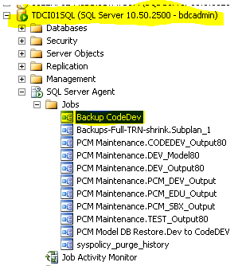
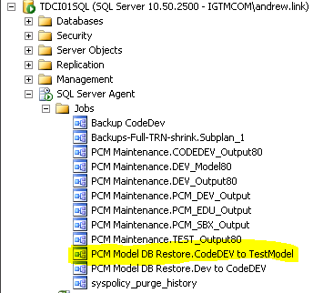
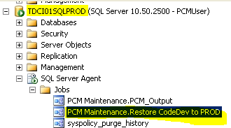

# Rules Publish from TST to PRD

1. Remote desktop into **TDCI01SQL**
2. Using SQL Server Management Studio connect to the **TDCI01SQL** database server
3. Execute (*"Start Job at Step..."*) the SQL Server Agent Job *“Backup CodeDev”*

4. Open a command prompt and copy the file below into the window and hit enter
    1. C:\Infor\CopyDatabase - codeDEV to PRD.bat
    
    *Note: the user running the bat file will need access to both the source and target folders referenced in the bat file*
    
    2. Verify the database has been copied to this shared drive *(\\\TDCI01SQLPROD\Backup)* and the Date Modified has changed to the current time.
    

5. Execute (*"Start Job at Step..."*) the SQL Server Agent Job *“PCM Model DB Restore.CodeDEV to TestModel”*

6. Using SQL Server Management Studio connect to the **TDCI01SQLPROD** database server
7. Execute (*"Start Job at Step..."*) the SQL Agent Job *“PCM Maintenance.Restore CodeDev to PROD”*

***In the event of needing a revert back to the previous state of PRD.***
1. Execute (*"Start Job at Step..."*) the SQL Agent Job *“PCM Maintenance.Restore PROD from safety backup"*

***The below information is no longer an issue but is kept as a reference in case connection or trace file issue arise again.***
1. Launch Design Studio and connect to Instance: **PCM_DEV**, Application: **PCM_DEV_DESIGNUI**

2. Make sure the M3 Data Source Database is **M3FDBDEV**

3. Make sure the ActiveConnectionString Data Source Server is **trainingdb.igtm.com**

4. Make sure *Tracing* is set to True after the PRD publish. This forces the configurator to log trace files for debugging.

[Back to Deployments](../deployments/deployments.md)