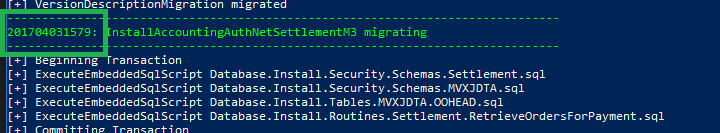

# Running Database Migrations in the CMS Project

## Allow PowerShell Scripts to Execute in Windows

Windows 10 does not allow powershell scripts to execute by default. This is a security measure. For our purposes, we need to allow the execution of RemoteSigned scripts. 
1. Open **Windows PowerShell** as an **administrator**.
1. Run the command **Set-ExecutionPolicy -ExecutionPolicy RemoteSigned**.

## Install SQL Server PowerShell Module

Executing our database migration script requires the SQL Server PowerShell module.
1. In the Windows PowerShell run the command **Install-Module -Name SqlServer**.
1. You will be asked multiple times if you want to continue with the installation. Select yes. 
  
## Run the Migration Script

First you will need to run the migrations with a drop databases flag. This will help ensure a smooth migragtion. The migrations can then be ran without the flag.   
1. In the Windows Power Shell, change the working directory to **\<cms_repository\>\Web_Admin\deployment_scripts**. 
1. Run **./DeployDatabaseMigrations.ps1 -DropDatabases 1**.
1. Verify that no red error text was generated in the PowerShell output.
1. Look at the PowerShell output and find a **migration tag**. It should be a number at the beginning of a green block of text.

1. Copy the migration tag and search for it in your BusinessObjects project in the Web_Admin.
1. Comment out the line of code containing the migration number.

1. Rebuild the entire Web_Admin solution.
1. Run **./DeployDatabaseMigrations.ps1 -DropDatabases 1** again.
1. Verify the migration tag that you commented out cannot be found in the PowerShell output. 
1. Uncomment the line of code containing the migration tag, in your project. 
1. Rebuild the entire Web_Admin solution.
1. Run **./DeployDatabaseMigrations.ps1** without the drop databases flag. 
1. If everything is working correctly, the PowerShell output will show the database associated with the migration tag as being migrated (i.e. Should be able to find the migration tag). 
