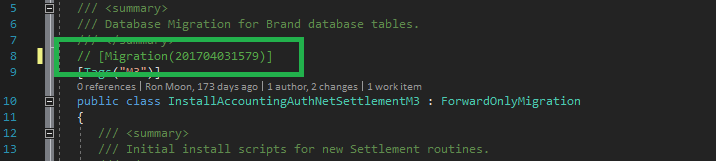

# Running Database Migrations

## Allow PowerShell Scripts to Execute in Windows

Windows 10 does not allow powershell scripts to execute by default. This is a security measure. You will need to allow the execution of RemoteSigned scripts. 
1. Open **Windows PowerShell** as an **administrator**.
1. Run the command **Set-ExecutionPolicy -ExecutionPolicy RemoteSigned**.
1. If you're running these command on your Virtual Machine or having issues with the previous command you may have to use the CurrentUser scope. **Set-ExecutionPolicy -Scope CurrentUser -ExecutionPolicy RemoteSigned**

## Install SQL Server PowerShell Module

Executing our database migration script requires the SQL Server PowerShell module.
1. In the Windows PowerShell, run the command **Install-Module -Name SqlServer**.
1. You will be asked multiple times if you want to continue with the installation; Select yes. 
  
## Run the Database Migration Script

First you will need to create the TestDB and TestDBM3 databases on the SQL Server (localdb)\MSSQLLocaldb. Once you've connected to the server (localdb)\MSSQLLocaldb in SQL Server Management Studio using Windows Authentication you'll then execute these two SQL Scripts below.
CREATE DATABASE TestDB;
CREATE DATABASE TestDBM3;

After creating the databases move onto the steps below.

1. In the Windows Power Shell, change the working directory to **\<cms_repository\>\Web_Admin\deployment_scripts**. 
1. Run **./DeployDatabaseMigrations.ps1 -DropDatabases 1**.
1. Verify that no red error text was generated in the PowerShell output.
1. Look at the PowerShell output and find a **migration tag**. It should be a number at the beginning of a green block of text.

1. Copy the migration tag and search for it in your BusinessObjects project in the Web_Admin.
1. Comment out the line of code containing the migration number.

1. Rebuild the entire Web_Admin solution.
1. Run **./DeployDatabaseMigrations.ps1 -DropDatabases 1** again.
1. Verify the migration tag that you commented out cannot be found in the PowerShell output. 
1. Uncomment the line of code containing the migration tag, in your project. 
1. Rebuild the entire Web_Admin solution.
1. Run **./DeployDatabaseMigrations.ps1** without the drop databases flag. 
1. If everything is working correctly, the PowerShell output will show the database associated with the migration tag as being migrated (i.e. Should be able to find the migration tag). 

## Errors during Database Migration Script

**localdb login failed**

Migrate.exe : !!! Cannot open database "TestDb" requested by the login. The login failed.
At C:\JeffreyCodeRepo\cms\Web_Admin\deployment_scripts\DeployDatabase.ps1:37 char:3 Login failed for user 'DESKTOP-RKFMGAJ\VMDev'.

1. If you run into this localdb login error you'll want to connect to the database Server "(localdb)\MSSQLLocaldb" from your SQL Server Management Studio. This should automatically add a login for your windows account to the security login users. If you still get the error you will want to create the databases manually that are throwing the error.

**Invoke-Sqlcmd : Could not load file or assembly 'Microsoft.SqlServer.BatchParser**

The error Invoke-Sqlcmd : Could not load file or assembly 'Microsoft.SqlServer.BatchParser, Version=14.100.0.0 seems to be caused by a 32/64 bit versioning problem on each developers computer.
There's an online discussion here about the problem. https://social.technet.microsoft.com/Forums/office/en-US/7a71121c-83b1-49b4-ad30-3a5f20e7afbf/smo-2017-microsoftsqlserverbatchparserdll-load-error?forum=sqlsmoanddmo
The way around this is to use the working version of Powershell ISE on your local computer. If the 32 bit version (x86) isn't working you have to run the Powershell ISE in the 64 bit version instead.

**Cannot connect to (LocalDB)\MSSQLLocalDB -> Login failed for user 'User-PC\User'**

It requires updating a ParentInstance Value with an invalid Value and then updating it back to the correct Value that was set before. (MSSQL13E.LOCALDB -> MSSQL13.1E.LOCALDB -> MSSQL13E.LOCALDB) I've also seen the Windows API LogSqlDiagRec reach a "Stopped" state after a long period of time. So waiting over night would possibly fix the error as well. You can view this error in the Windows Event Viewer (Windows Logs/Application). Error = "Windows API call LogSqlDiagRec returned error code: 0. Windows system error message is: The operation completed successfully. Cannot open database "TestDb" requested by the login. The login failed." If you type "sqllocaldb info mssqllocaldb" into CMD you will see the MSSQLLocalDB is in a Running State.

To quickly hack a fix you'll want to update the HKEY_CURRENT_USER\Software\Microsoft\Microsoft SQL Server\UserInstances\ParentInstance value MSSQL13E.LOCALDB to MSSQL13.1E.LOCALDB and back to MSSQL13E.LOCALDB again. This invalid version "13.1" forces MSSQLLocalDB into a Stopped State because it's the wrong version when trying to connect in SSMS the next time. This allows you to run the commands in CMD (sqllocaldb stop mssqllocaldb, sqllocaldb delete mssqllocaldb, sqllocaldb start mssqllocaldb). Once these commands are ran successfully you can login to the server (localdb)\MSSQLLocalDB through SSMS.

Related Link: https://stackoverflow.com/questions/36950078/cannot-connect-to-localdb-mssqllocaldb-login-failed-for-user-user-pc-user
