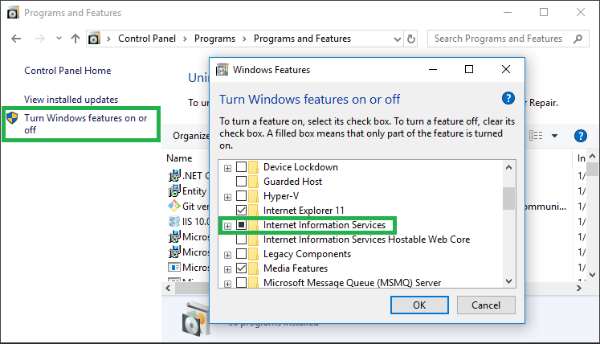

# Setting up a Dev Environment for GTMSportswear.com

### Install Visual Studio 2017

It's important to make sure the correct components are included with your Visual Studio installation. If any components are missed during the installation process you can reopen the installer to modify your installation, while adding the components.
1.	Download Visual studio Professional 2017 here: https://www.visualstudio.com/downloads/.
1.  The Visual Studio installer will direct you to an **Installing Visual Studio** screen. You can select additional components to include with the Visual Studio core editor. Don't deselect any components selected by default.
1.	Make sure the following are selected under the **Workloads** tab of the **Installing Visual Studio** screen
    *	ASP.NET and web development
    *	Azure development
    *	.NET Core cross-platform development
    * Optional: Desktop development with C++ (allows you to quickly include front-end dependancies with NPM Install)
1.	These components should be added under the **Individual Components** tab
    *	Python 3 64-bit (3.6.3)
    *	Windows 8.1 SDK
1. Once the correct components are selected, finish the installation process. 
   
### Verify permissions

Once Visual Studio 2017 has been successfully installed, a Visual Studio Team Services (VSTS) user account will need to be associated with it. The following is a way to check if your account has been created and given proper permissions. This section can be skipped if you know the correct permissions have been granted.  
1.	Go to the GTM Sportswear VSTS website here: https://gtmsportswear.visualstudio.com/_projects.
1.	Sign in using your work email and associated password.
1.	Under the **settings** (looks like a gear) dropdown select **Security**. 
1.	Select **GTM Sportswear – Development Group** in the drop down list on the left hand side of the page.
1.	Select **Members** and verify that your name is included on the list of members.

    
### Clone the Project

Now Open Visual Studio 2017. In the top right hand corner of Visual Studio is a prompt to sign in as a user. 
1.	Sign in using your work email and password.
1.	If your account has been given proper permissions you should now be able to access GTM projects through the **Team Explorer** window. 
1.	Select the **green connection icon** at the top of the **Team Explorer** window.
1.	Click the **manage connections Icon** and select **Connect to a Project** in the dropdown.   
1.	From the new view you can select the **gtm ->> gtm** project and clone it to a destination of your choice (the default location is fine).
1.  Once the project has finished downloading, it will be automatically selected and appear in the **Solution Explorer**.
1.  Double click on **GTMSportswear** in the **Solution Explorer**. This sets it as the default startup project.
1.  Visual Studio may ask you if you want to update the Typescript version in your project to match the current version. Select **no**. We do not transpile typescript through Visual Studio, we instead use seperate build tools (setup below) through a terminal.

### Remove Gtm.Web from Visual Studios Build List

Next you will want to remove **Gtm.Web** from the list of projects to build while debugging. This is because **Gtm.Web** has not been configured to ignore Typescript files while building in Visual Studio, resulting in build errors. 
1.	In Visual Studio go to **Build ->>  Configuration Manager** (Build is a tab along the top of Visual Studio).
1.	Deselect build for **Gtm.Web**.

### Change Window's Setting

By default, Windows may prevent Visual Studio’s emulator from displaying the website through localhost. This problem can be fixed by changing a setting through Window’s control panel.
1.	Go to **Control Panel ->> Programs ->> Programs and Features ->> Turn Windows features on or off ->> Internet Information Services**.
1.	Activate **Internet Information Services**.

    
### Install Web Dependancies

The GTMSportswear project has several web dependancies that are not tracked through source control. This is because they can be easily installed in your local environment with npm. 
1. Open a terminal, such as Window's Command Prompt, and change the working directory to **\<gtm_repository\>\GTMSportswear.com**. 
1. If **Desktop development with C++** was included in Visual Studio dependancies: Run **npm install**.
1. If Grunt is not installed, run **npm install grunt --save-dev**.
1. Install the Grunt command line interface globally with **npm install -g grunt-cli**.
1. Install the Karma command line interface globally with **npm install -g karma-cli**.
   
### Run in Debug Mode

Finally, check to see that the GTM website runs in localhost through the Visual Studio debugger.
1. Run **grunt** from the command line.
1. From Visual Studio press **F5** or alternately press the **green play button** at the top-center of Visual Studio.
1. A locally hosted website should appear in your browser that resembles https://gtmsportswear.com/.
    
### TreamStore FrontEnd Setup

For the TeamStore there shouldn't be a need for Grunt or Bower as they've switched it over to npm script use.

1. Open a shell and navigate to the local git repository for TeamStore, cd into `presentation\GTM.TeamStore.Web`
2. Run the command `npm install`
3. Once finished, run the command `npm run dev`.

You can now start debugging in Visual Studio. The dev script includes compiling of css, typescript, javascript, and moving these files to the components folder. The script will perform a watch over these for changes.

#### Other useful Scripts
After Setting up your environment as above, there are a few other useful scripts that can be used:

1. `npm test`
2. `npm run sync`

### Workstation Setup Gotchas
   - Make sure Tools → Options → Projects and Solutions → Web Projects → 'Use the 64 bit version of IIS Express' checkbox is checked.
   - Open Gtmsportswear.com project folder in File Explorer → Go to bin folder → Make sure the MvxSockx64.dll and MvxSockNx64.dll are both in the folder, if not, grab them from the parent folder and copy them in.

1. This will install all the node packages that the TeamStore solution requires.
2. This is identical to what the grunt command used to do, but is now funneled through npm only.
3. This will run the front-end karma tests from the command line. To run npm run dev with the test script, you will need to open two separate shells or two separate shell tabs (cmder).
4. This is used for developers that wish to use browsersync. The sync script will run the dev script, along with running browsersync on localhost:3000.
