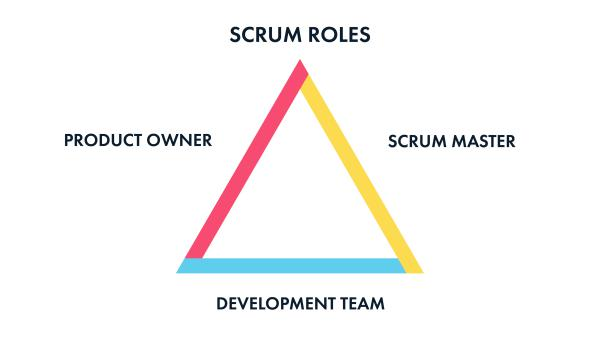

# Agile Scrum - Overview
**Scrum** is one of several techniques for managing product development organizations, lumped under the broad category of agile software development. 

**Agile** approaches are designed to support iterative, flexible, and sustainable methods for running a product engineering organization.

## Scrum Roles
Scrum has no hierarchy, but each of the three roles has equal and defined responsibilities.

### Stakeholders
A product owner controls and steers a product in a direction that benefits the company and customers. The product owner is involved in steering committee meetings and responsible for pushing ideas for development.

A business owner has a shared responsibility to the team and to the customer. The business owner is the voice of the customer, and stands in as the representative of the customer's needs, wants, and expectations.

### Scrum Master
A scrum master is the glue that ties a scrum team together. Scrum masters are responsible for keeping people clear on their roles, managing the rituals and artifacts of scrum, and coaching people within the team and across the organization to help overcome blockers and maintain a sustainable productive pace.

Their responsibilities include the daily stand-up, the [sprint planning](planning.md#planning) meeting, the [sprint review](planning.md#review) meeting with stakeholders, and the [sprint retrospective](planning.md#planning#retrospective) meeting.

### Developer
Most scrum teams consist of a set of four to eight members. Their specializations should be planned to support the type of work the team is going to be responsible for, so they can estimate it well and produce results that meet the team's definition of done.

A team member is responsible for the quality of the product being developed, and for the preservation of the scrum process for the entire team. These are two aspects that every team member has the authority to affect by the way they perform their duties.

The team is expected to *push back against any attempts to sacrifice quality for the sake of speed*, given the practical constraints of the project. Additionally, the team should be tracking the overall quality of the code-base, and proposing stories that would refactor the existing code to enhance maintainability, or to support emerging technical standards. Keeping the code clean, self-documenting, and internally consistent helps everyone on the team work together more effectively.

## Scrum Process
See [Process](process.md).

## Scrum Sprints
See [Sprints](sprints.md).

## Scrum Artifacts (Glossary)

### Sprint
A sprint is length of time in which a team has to work on a set of user stories. **Our sprints last 2 weeks.**

### User Story
A user story is a short description of customer's need.

The user story describes the type of user, what they want and why. A user story helps to create a simplified description of a requirement.

A user story must represent value to a customer, ultimately resulting in perceived revenue to the business.

#### Examples of user stories
> As a sales rep configurator user, I want to be informed of new features and updates, so that I can actively use the new features when they are released.

> As a gtmsportswear.com shopper, I want to be able to find a product quickly so that I can view the product details.

> As a GTM Sportswear account holder, I want my login details encrypted, so that I know my information is safe and secure.

#### Examples of bad user stories
> As a user I want to be able to manage products, so that I can remove expired and erroneous products.

The reason this user story is bad is not because it lacks the three main criteria, but instead it lacks a focused user. We cannot generalize a *user* to simply a user of our site, but instead would focus on a persona. In this case, our user would be a "marketing content manager." This persona then would establish the correct business owner to reach out to.

> As a developer I want to update the CMS product page, so that I have a more maintainable code for futher development.

This is a perfect example of technical debt. While technical debt should be worked on every sprint, it doesn't deliver value to a customer, and therefor not defined as a user story. Instead, it should be apart of a separate but equally important, technical debt backlog.

*See further examples on [Scrum Alliance](https://www.scrumalliance.org/community/articles/2011/august/5-common-mistakes-we-make-writing-user-stories).*

### Acceptance Criteria
A user story needs a set of criteria to be tested upon in order to be accepted as done. This set should be finite and specific. This is aptly named *acceptance criteria*.

To setup this criteria, we use a form called *Given-When-Then* which outlines the specific form in which it should be written.

> **GIVEN** a category results page,

> **WHEN** the products are initially loaded,

> **THEN** any products that have the feature flag need to be displayed first.

### Definition of Done
*To be added.*

### Impediment
Any blocker or issues that will keep a developer from completing their assigned stories and/or tasks.

Examples of impediments:
* Waiting on questions to be answered by a stakeholder before more work can be completed.
* A build process is holding up the release of code.
* A story which relies on another piece of code to be completed first is not yet done.

### Bugs and Defects
**Bugs** are issues that arise from QA on stories *before they affect customers*.

**Defects** are issues that arise and *are currently affecting customers*.

## Sources
* Green, M. D. (2016). *Scrum: Novice to Ninja*. Victoria, Australia: Sitepoint.
* Kaczor, K. (2011, August 3). 5 Common Mistakes We Make Writing User Stories. Retrieved February 11, 2017, from [https://www.scrumalliance.org/community/articles/2011/august/5-common-mistakes-we-make-writing-user-stories]()