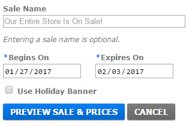
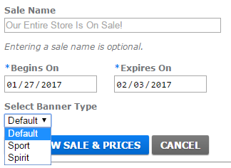

# Feature Toggles and When to Use Them

## What Is a Feature Toggle?
A feature toggle is a mechanism in which to release code straight to production in a hidden, but toggeable state. It allows people to see features before they are completely ready to be launched.

## The Problem
At GTM, we work really hard to keep our deployment pipeline clear of blockages so that, at any moment, we can release new code into Production.

In order to keep this level of throughput, we can not push half-finished code into the master branch as that would create a blockage, since the code is not ready for users to see.

We also do not want to create extraneous git branches that are never quite finished. These branches will have the potential to accumulate more and more merge conflicts the longer they remain unmerged into master. 

Finally, we need a way for Business Owners to be able to test new functionality before the general public sees it while keeping fidelity in the way that a customer would see it when launched.

## How Feature Toggles Help Solve This
Feature toggles solve all of the above situations:

* Code will be merged into the master branch, but hidden from end-users as a default state.
* Merge conflicts are limited since feature toggled code is already in the master branch.
* We are able to provide special query string settings which allow Business Owners to toggle the particular features they wish to evaluate prior to launch.

## Feature Toggle Life-Cycle
1. First you will need to add the feature toggle to the server environment in the form of _feature_toggle_xyz_, where the name is prepended by "feature_toggle_".
2. Set the feature toggle to "0", or off, by default.
3. Second, you will need to add a conditional around the code you which to enable toggling. This code can be server-side or front-end code. The feature toggle automatically becomes available to use in both cases.
4. Code review and release code.
5. Have Business Owner review using toggle.
6. Once approved, set feature toggle to "1" to launch.
7. Once enough time has passed, go through and clean-up old code. (Technical Debt)

## When _NOT_ to Use a Feature Toggle
Before explaining the specific situations in which a feature toggle should be used, it is important to set some expectations around when a toggle is _not helpful_.
* Simple copy changes.
* Simple styling change.
* Anything that might take more time to develop out a feature toggle than the feature itself.

### The Risk of Toggles
Just as with any new development, there is an inherent risk of making a mistake and breaking something. Since feature toggles go directly into Production, they carry a miniscule (but nevertheless present) risk with every deployment. 

A good example of a place not to use a feature toggle would be a copy change:
```html
<!-- Original Code -->
<h3>Ready. Set. Camp;</h3>

<!-- New Code -->
<h3>Ready. Set. Camp!</h3>

<!-- Adding a feature toggle around this is just as risky as the change itself (i.e. both are low risk) -->
```

### Adding a Feature Toggle is Extra Work
Developer time is expensive. While feature toggles are extremely valuable, there are times when they are not worth the effort. To add a feature toggle, a developer needs to create one or more switches in the code, and then later remove those switches to make the toggle permanent. Each change requires code reviews from multiple developers.

An example of a simple change:
```javascript
// Before
displayPanel.classList.add('color-green');

// After
displayPanel.classList.add('color-red');
```

An example of the same change with a feature toggle:
```xml
<!--
First we have to change a setting in a configuration file.
We'll have to issue 2 more pull requests against this file, 
first to turn it on by default, and then to remove it later.
-->
<add key="feature_toggle_color_change" value="0" />
```
```javascript
// Then in another file in the code
if (FeatureToggleManager.hasFeature('color_change')
	displayPanel.classList.add('color-red');
else
	displayPanel.classList.add('color-green');
```

## When _TO_ Use a Feature Toggle
The default is to use a feature toggle. That being said, a feature toggle should be used for:
* Any significant change to an end-user facing interface (e.g. the website). 
* Any possibly breaking changes to an internal user interface (e.g. CMS).

## The _GREY_ Area
Probably the most important discussion of this document is the grey area between copy changes and full blow feature changes. 
Unfortunately there is no clear guideline to make this decision, and it will have to be determined on a case by case basis. 
If new requested development feels to a Business Owner or a Developer like it might be a grey area regarding the use of a feature toggle, 
this should be communicated _before_ development starts. 

### Example
We once needed to change a radio button to a select dropdown. We elected to forgo a feature toggle on this, and later decided it would have been a good idea to use a toggle.

**Original**



**Updated**



## Exceptions
There are, of course, always exceptions. Usually the exception relates to a code base which has not been prepped to be able to show feature toggles. Developers should make this clear to Busines Owners as early in the planning process as possible if this is the case, and a specific release plan should be constructed.