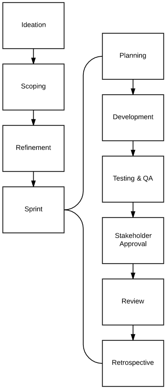

### Scrum Planning Process

#### Ideation
Where all great ideas start out. They come here for review and to collect further details until a time when the steering committee decides to move forward with it.

#### Scoping
When ideas have been approved to move forward by the steering committee, they move into scoping. Scoping is a time to get rough estimates of work to be done in the form of a T-Shirt sizing, compile cost, revenue and ROI information, and complete out feature requirements:

* Problem
* Vision
* Goal
* MVP Requirements
* Launch Plan

Scoping is also a time for team leads to ask initial questions to the stakeholders and get feedback before refinement.

**When does this meeting occur?** Whenever scoping work needs to be done after items move over from ideation.

User stories should be defined or made clear during scoping. Ideally, stakeholders are responsible for creating user stories, which define value in the perspective of a customer. Until user stories are defined, there are no artifacts available to be moved into refinement.

#### Refinement
The refinement meeting is a time-boxed meeting for the scrum team to get in the same room and accomplish two very important tasks:

1. Groom the backlog so that two to three sprints' worth of user stories are ready for development.
2. Refine backlog user stories to be ready for development.

**When does this meeting occur?** The second Monday of a sprint.

During refinement, with the help of the scrum master and product owner, the scrum team should be able to define priority and associate user stories to the correct sprint based on business needs.

Ideally, user stories should go through two refinement meetings before development commences on them. The first refinement meeting would be the coarse refinement which you narrow down acceptance criteria and clarify business objectives. The second refinement would be for defining discrete tasks for work to be done based on the acceptance criteria.

Be careful not to **overplan**. User stories should have just enough planning to get started on development. It is okay to have some unanswered questions during the sprint **collaboration between a developer and stakeholder is encouraged**.

#### Planning
The planning meeting is a time-boxed meeting for the scrum team to get in the same room and decide which user stories they are going to work on for the sprint.

User stories and their tasks should be assigned to individual developers to be worked on. Developers should have a good idea of what they would want to work on based on expertise.

During planning, if there is significant rollover of stories from the previous sprint, it may be necessary to move out other user stories at this time and wait for another refinement to reprioritize the backlog.

**The goals of the planning meeting:**
1. Determine capacity of user stories to be worked on, do not allow any overage.
2. If there are any rollover stories from the previous sprint, move out the lowest priority items to make room for them to be worked on first.
3. Assign user stories and tasks to developers.

**When does this meeting occur?** The first Monday of a sprint.

#### Sprint Development
[Sprints](sprints.md)

#### Review
The review is a meeting when the entire scrum team, plus any extra parties, come together to share and demo work that has been completed in the sprint.

**When does this meeting occur?** The final day of the sprint, usually in the afternoon.

#### Retrospective
This meeting is a time for the entire scrum team to come together to reflect upon the sprint.

* What went well?
* What could have gone better?
* What should we work on getting better at next sprint?
* What should we add to the kaizen?

**When does this meeting occur?** The final day of the sprint, usually in the afternoon right after the sprint review.