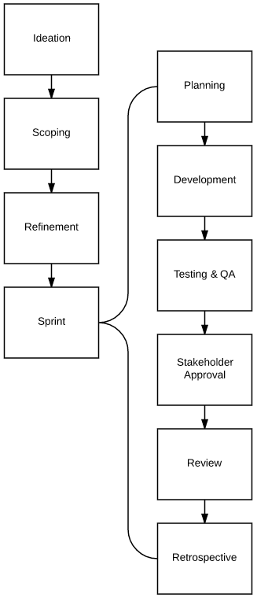

# Sprint Development
Sprints last for 2 weeks. There are daily rituals that occur during this time, namely the daily stand-up and completing assigned user stories.

During development, a developer should be keeping careful watch of their assigned stories that are currently in testing. They are accountable for those items and should follow-up with the QA tester so it does not become an impediment.

## Planning
The planning meeting is a time-boxed meeting for the scrum team to get in the same room and decide which user stories they are going to work on for the sprint.

User stories and their tasks should be assigned to individual developers to be worked on. Developers should have a good idea of what they would want to work on based on expertise.

During planning, if there is significant rollover of stories from the previous sprint, it may be necessary to move out other user stories at this time and wait for another refinement to re-prioritize the backlog.

**The goals of the planning meeting:**
1. Determine capacity of user stories to be worked on, do not allow any overage.
2. If there are any rollover stories from the previous sprint, move out the lowest priority items to make room for them to be worked on first.
3. Assign user stories and tasks to developers.

**When does this meeting occur?** The first Monday of a sprint.

## Daily Stand-up
The daily stand-up is a way to allow for easy communication between scrum members. The ceremony has three main questions to be answered:

1. What did I complete yesterday?
2. What do I plan to complete today?
3. Will I run into any impediments?

It allows developers to communicate with other developers if they need help on something. It also allows developers to communicate with the scrum master on impediments so they can try and get them resolved as quickly as possible.

## Review
The review is a meeting when the entire scrum team, plus any extra parties, come together to share and demo work that has been completed in the sprint.

**When does this meeting occur?** The final day of the sprint, usually in the afternoon.

## Retrospective
This meeting is a time for the entire scrum team to come together to reflect upon the sprint.

* What went well?
* What could have gone better?
* What should we work on getting better at next sprint?
* What should we add to the kaizen?

**When does this meeting occur?** The final day of the sprint, usually in the afternoon right after the sprint review.

## Questions and Answers

### If you complete items sooner than expected, what should you work on?
Sometimes it happens, we plan out a sprint and because you are a rockstar, you get done early! But now what? Should I twiddle my thumbs until the sprint is over? Luckily, we have a list just for this!

1. **See if there are any outstanding code reviews you can help out on.**
2. **See if there are other user stories that you can help out on.** Stories that have not been started yet are the highest priority, followed by items that are partially done. *Be careful!* Do not interrupt somebody's workflow as they may be unwelcoming to an interruption; they are trying to complete their work for the sprint as well.
3. **Technical Debt Backlog items.**
4. **Look at error logs** to see if anything is getting past our radar.
5. **Research and reading** on newest happenings and trends in the industry. Try something new!
6. **Pull from next sprint.** Contact the scrum master and pull things off next sprint.

## Sprint Process
